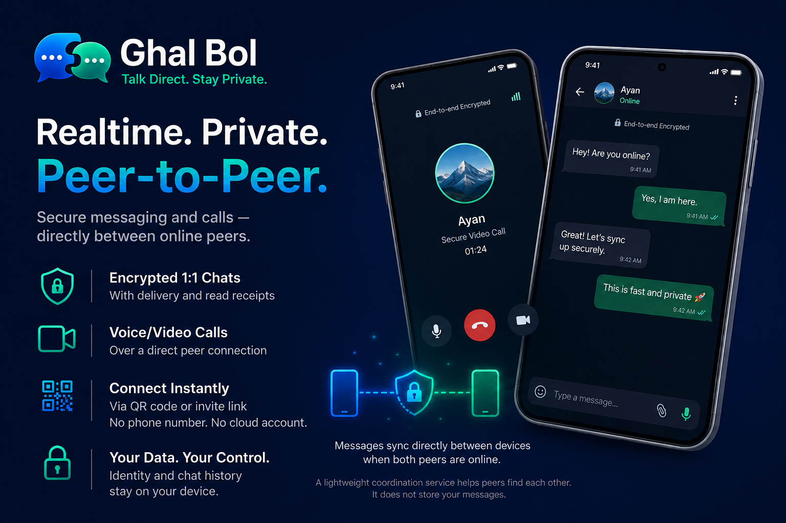

# Ghal Bol

  

Gh`al Bol is a realtime peer-to-peer messaging system focused on direct communication, local-first identity, minimal infrastructure dependency, and high-speed synchronization between online peers.

The project intentionally avoids traditional cloud-centric messaging architecture. There are no phone numbers, no email-based accounts, no permanent centralized chat storage, and no server-owned transcripts. Users own their identities, messages, and local history.

The system is designed around a simple principle:

> Communication happens when peers are online simultaneously.

Unlike traditional messengers such as WhatsApp or Signal, Ghal Bol does not aim to provide permanent cloud-backed offline message guarantees. Instead, it focuses on deterministic realtime synchronization, direct peer communication, and decentralized temporary relaying.

**Architecture & transport:** [docs/DESIGN.md](docs/DESIGN.md), [docs/TRANSPORT.md](docs/TRANSPORT.md). Product connectivity story: [docs/STORY.md](docs/STORY.md) (human-maintained).

**Invites & coordination:** [docs/GHAL_BOL_URI_SCHEME.md](docs/GHAL_BOL_URI_SCHEME.md), [docs/COORDINATION_SERVER.md](docs/COORDINATION_SERVER.md)

---

# Core Philosophy

Ghal Bol separates identity from infrastructure.

Users own:
- their cryptographic identity
- their local transcript
- their delivery state
- their communication history

Servers only assist with:
- peer coordination
- endpoint discovery
- presence tracking
- relay coordination

The server is not the owner of chats, identities, or messages.

---

# Identity Model

Each installation uses a local cryptographic identity (public/private secp256k1 keypair). The app can **create** a new key on first setup or **import** an existing 64-hex private key or encrypted keystore backup. Optional **premium infrastructure** (paid Tier 3 relay) is separate from identity and payments — see [docs/IDENTITY.md](docs/IDENTITY.md) and [docs/PREMIUM_SERVICES.md](docs/PREMIUM_SERVICES.md).

Identities are:
- local-only
- user-owned
- self-generated
- independent from centralized accounts

The system does not require:
- phone numbers
- email addresses
- usernames controlled by servers

Peer connections can be established through QR codes, invite links, or public key exchange.

**Invite URLs (domain we use today):**

- Web: `https://ghalbol.com/connect/<public_key_hex>`
- App: `ghalbol://connect/<public_key_hex>`

The link identifies the peer only; the app resolves live endpoints via `ghal_bol_server`, then connects directly. See [docs/TRANSPORT.md](docs/TRANSPORT.md) § Discovery. **HTTPS invites:** with verified App Links (`/.well-known/assetlinks.json` on the site), Android opens the app directly; otherwise the browser shows the [web invite handoff](docs/WEB_SITE.md). **Linux desktop:** [download page](https://ghalbol.com/download/linux).

---

# Presence and Registration

Each peer maintains lightweight presence with the coordination server.

When a peer connects:
1. The server sends a nonce challenge.
2. The peer signs the nonce using its private key.
3. The server verifies the signature.
4. The peer’s endpoint registration is accepted.

This ensures that a peer can only register endpoints for identities it actually owns.

The server stores:
- peer public key
- current reachable endpoints
- transport capabilities
- heartbeat timestamp
- optional IPv6 and IPv4 addresses

Presence is ephemeral and expires automatically if heartbeats stop.

---

# Networking Model

Every peer in Ghal Bol acts as both:
- client
- server

Peers communicate directly whenever possible.

Preferred connection order for a configured contact ([STORY.md](docs/STORY.md), [TRANSPORT.md](docs/TRANSPORT.md)):

1. Existing active session (resume)
2. **WAN first** — coord lookup + relay circuit + public TCP when registered
3. **LAN exception (per-peer):** when mDNS shows the contact on the local LAN → direct TCP immediately; losing LAN falls back to WAN without user-visible disruption
4. **libp2p Circuit Relay v2** on a **Ghal Bol relay** (co-located with coord) for NAT/CGNAT, then **DCUtR** hole-punch to upgrade to a direct link

Peer **discovery over WAN requires coord + relay** when both peers have internet. When coord is unreachable, **LAN (mDNS) still works**; the background node keeps retrying all configured coord servers. The app does **not** fall back to Kademlia DHT or public libp2p bootstrap peers for WAN discovery. Multiple coord servers are supported as a list (today a single production entry).

The system is designed to be:
- IPv6-first
- direct-communication-first
- reconnect-friendly
- mobile-aware

QUIC over UDP is the preferred transport because of:
- lower latency
- multiplexed streams
- better reconnect behavior
- improved mobile roaming support

---

# Synchronization Model

Ghal Bol is synchronization-oriented rather than stream-oriented.

Instead of treating communication as a permanent socket session, peers perform short-lived synchronization sessions where they:
- exchange pending messages
- exchange acknowledgements
- synchronize transcript state
- resume interrupted transfers

Synchronization sessions are:
- reconnectable
- resumable
- idempotent
- replay-safe

Every message has:
- globally unique ID
- sender identity
- recipient identity
- timestamp
- encrypted payload

The protocol assumes reconnects and temporary disconnections are normal.

---

# Message Delivery

Messages are primarily delivered through direct peer synchronization.

Typical flow:

1. Peer A comes online.
2. Peer B comes online.
3. Coordination server notifies interested peers.
4. Peers establish direct connection.
5. Messages and acknowledgements synchronize directly.

Messages are stored locally by peers and retried while both peers remain online.

The system intentionally does not guarantee permanent centralized offline delivery.

---

# Temporary Distributed Relay (Tier 2)

If a recipient peer is offline, Ghal Bol can optionally use decentralized temporary relaying (Tier 2 peer blob relay; Tier 3 paid backup — see [docs/PREMIUM_SERVICES.md](docs/PREMIUM_SERVICES.md)). **Not implemented yet** in this repo.

Example flow:
1. Peer B wants to send message to offline Peer A.
2. Coordination server selects at least 8 currently online peers.
3. Encrypted message blobs are distributed across selected peers.
4. Relay peers temporarily retain encrypted payloads.
5. Once Peer A becomes reachable, synchronization occurs.
6. Relay copies are discarded automatically.

Relay peers:
- cannot decrypt messages
- only store opaque encrypted blobs
- retain data temporarily
- operate under bounded storage limits

The coordination server itself does not permanently store message content.

This mechanism improves:
- availability
- survivability
- decentralized resilience

without relying on permanent centralized infrastructure.

---

# Mobile Networking Philosophy

Mobile networking is inherently unstable because of:
- NAT
- CGNAT
- WiFi/mobile switching
- app suspension
- battery optimizations
- temporary reachability loss

Ghal Bol assumes:
- reconnects are normal
- sessions are temporary
- synchronization must be resumable
- presence is ephemeral

The protocol is therefore designed around deterministic synchronization instead of fragile long-lived socket assumptions.

---

# Protocol Design Principles

## Local Ownership

Peers own:
- identity
- transcript
- delivery state
- synchronization state

## Minimal Trust

Servers assist coordination but do not own:
- message history
- identities
- transcript truth
- communication state

## Idempotency

All synchronization operations must be replay-safe.

Duplicate synchronization attempts must never corrupt state or create inconsistent transcripts.

## Deterministic Behavior

The project prioritizes:
- predictable synchronization
- observable behavior
- practical reliability

over theoretical decentralization purity.

---

# Future Possibilities

Potential future extensions include:
- LAN-first synchronization
- direct WiFi communication
- voice/video calls
- encrypted attachment streaming
- decentralized relay reputation systems
- opportunistic peer caching
- relay incentives
- local network discovery

---

# Non-Goals

Ghal Bol is intentionally not:
- a cloud messaging platform
- a social network
- a centralized chat service
- a permanent message archive
- a phone-number-based identity system

---

# Project Direction

Ghal Bol explores a middle ground between fully centralized messengers and fully decentralized swarm-based systems.

By combining:
- centralized coordination
with
- direct peer synchronization

the project aims to provide:
- fast realtime communication
- resilient direct messaging
- low infrastructure dependence
- strong user ownership
- modern peer-to-peer networking

without the complexity and unpredictability of large-scale decentralized swarm architectures.

---

# Repository

Open this directory as the workspace root (the folder that contains this `README.md`).

| Path | Role |
|------|------|
| `ghal_bol/` | Rust core: identity, libp2p sync engine, local stores |
| `ghal_bol_server/` | Coordination server — see [ghal_bol_server/README.md](ghal_bol_server/README.md) |
| `ghal_bol_ui/` | Flutter UI shell — [ghal_bol_ui/README.md](ghal_bol_ui/README.md) |
| `docs/` | [Design](docs/DESIGN.md), [transport](docs/TRANSPORT.md), [identity](docs/IDENTITY.md), [coord server](docs/COORDINATION_SERVER.md), [web site](docs/WEB_SITE.md), [doc index](docs/README.md) |
| `firebase.json` | Firebase Hosting for **ghalbol.com** (static web build) |
| `scripts/deploy_web_firebase.sh` | `flutter build web` + `firebase deploy --only hosting` |

---

# Production release (checklist)

**Full step-by-step guide:** [docs/PRODUCTION_RELEASE.md](docs/PRODUCTION_RELEASE.md) (P0 ship test → P1 infra → P2 Play Store)

**Coord server (live):** `https://coord.ghalbol.com` — smoke: `COORD_URL=https://coord.ghalbol.com ./ghal_bol_server/deploy/smoke_coord.sh`

| Phase | Key steps |
|-------|-----------|
| **P0** | Release keystore → `flutter build apk/appbundle --release` → two-phone ship test |
| **P1** | CI green, VM systemd + reboot, commit & push |
| **P2** | [Privacy policy](docs/PRIVACY_POLICY.md) online → [Play listing](docs/PLAY_STORE_LISTING.md) → AAB upload |

Build/run details: [ghal_bol_ui/env/README.md](ghal_bol_ui/env/README.md). Server deploy: [ghal_bol_server/deploy/README.md](ghal_bol_server/deploy/README.md).
