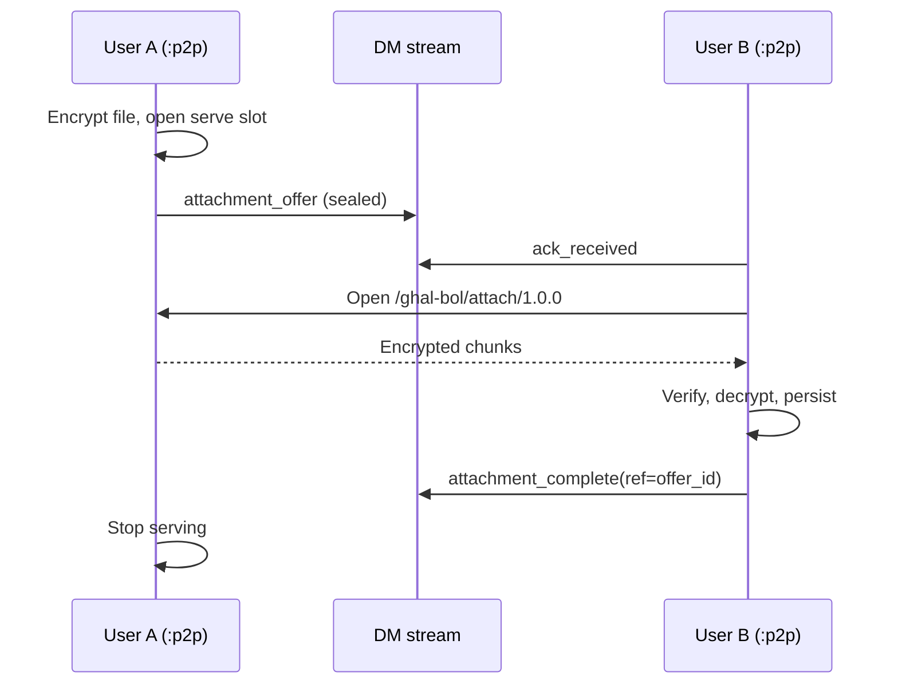

# Attachments — implementation plan (sender-served)

**Status:** Plan only — **not shipped.** Implement **after** [VOICE_MESSAGES_PLAN.md](VOICE_MESSAGES_PLAN.md) unless the user explicitly reorders.

**Depends on:** [DESIGN.md](DESIGN.md), [GHAL_BOL_DM_MSG_V1.md](GHAL_BOL_DM_MSG_V1.md), [TRANSPORT.md](TRANSPORT.md), [AGENTS.md](../AGENTS.md).

---

## Product goal

User A shares a **file** with user B in 1:1 chat:

1. **A serves** the file from A’s device (no central blob CDN in v1).
2. A sends an **E2E sealed offer** in DM (link + capability + decryption key) — not a public URL.
3. **B downloads** from A over the **existing P2P path** (LAN / relay), same connectivity as chat.
4. When B finishes successfully, B notifies A (`attachment_complete`).
5. **A stops serving** that blob (ephemeral host).

**Not in scope (v1):** Ghal Bol-operated blob storage ([PREMIUM_SERVICES.md](PREMIUM_SERVICES.md) Tier 2/3), group shares, or sending file bytes inside the DM frame.

---

## Design principles

| Rule | Detail |
|------|--------|
| **Chat carries the offer only** | Small sealed `attachment_offer` on `/ghal-bol/msg/1.0.0`. |
| **Bytes on a dedicated substream** | New native protocol e.g. `/ghal-bol/attach/1.0.0` on the **same peer connection** as chat. |
| **Sender-served** | A is the HTTP-like origin; no upload to coord. |
| **E2E** | File encrypted **before** serve; key material only inside sealed DM offer. |
| **Recipient authority for completion** | A learns “downloaded” from B’s signed ack — same philosophy as delivery/read ticks. |
| **Rust owns policy** | Serve lifecycle, fetch, retry, stop-serving, transcript — Flutter is UI + file picker. |

---

## End-to-end flow

```text
A: pick file → encrypt → start serve(session) → build attachment_offer → seal → DM send
B: receive offer (poll) → ack_received → dial A → GET chunks on /ghal-bol/attach/1.0.0
B: verify hash → decrypt → save locally → attachment_complete(ref=offer_id) on DM
A: on attachment_complete → stop serve → optional outbound tick / UI “delivered”
```



---

## DM offer message (control plane)

### Envelope

Add `MsgKind::AttachmentOffer` (wire: `"attachment_offer"`) — same signed/sealed envelope as text.

### Inner JSON (before seal)

```json
{
  "attachment_version": 1,
  "blob_id": "<uuid>",
  "file_name": "report.pdf",
  "mime_type": "application/pdf",
  "size_plaintext": 1234567,
  "sha256_plaintext": "<hex>",
  "content_key_b64": "<AES-256 key for file ciphertext>",
  "expires_at_ms": 1735689600000
}
```

- **`blob_id`** — serve slot id on A; also DM message `id` for acks.
- **`content_key_b64`** — symmetric key for file encryption (only inside E2E seal).
- **`sha256_plaintext`** — B verifies after decrypt; A can require match before `attachment_complete` is accepted.
- **`expires_at_ms`** — A stops serving after TTL even if B never completes (default e.g. 7 days — product TBD).

**Do not** put a public `https://` URL in plaintext chat. Fetch is **in-app**: dial peer → attachment substream → `blob_id`.

Optional v1.1: short **signed capability** (A signs `blob_id ‖ B.pubkey ‖ expiry`) so fetch cannot be replayed by non-peers even if offer leaks.

---

## Data plane — attachment substream

### Protocol

| Item | Value |
|------|--------|
| Stream | `/ghal-bol/attach/1.0.0` (new, on existing connection) |
| Pattern | Length-prefixed frames (same 4-byte LE style as DM; reuse max frame guard) |
| Auth | Noise proves PeerId; handler checks remote == expected contact + optional capability |

### Request / response (v1)

**B → A (first frame):** fetch request

```json
{
  "action": "fetch",
  "blob_id": "...",
  "offset": 0
}
```

**A → B:** chunk frames

```json
{
  "action": "chunk",
  "blob_id": "...",
  "offset": 0,
  "data_b64": "<ciphertext bytes>",
  "final": false
}
```

**A → B (end):** 

```json
{
  "action": "complete",
  "blob_id": "...",
  "sha256_ciphertext": "..."
}
```

**Errors:** `action: "error", code: "not_found|expired|busy"`.

### v1 transfer policy

| Topic | v1 choice |
|-------|-----------|
| **Resume** | **Restart from offset 0** on failure (simplest). v2: `offset` resume. |
| **Chunk size** | e.g. 64 KB ciphertext per frame (align with call media max frame thinking) |
| **Parallel** | One fetch per `blob_id` at a time |
| **Encryption** | File encrypted on disk at rest on A before serve; chunks are ciphertext |

---

## Completion ack (control plane)

New ack kind or DM message kind: **`attachment_complete`**

| Field | Value |
|-------|--------|
| `kind` | `attachment_complete` |
| `ref_id` | `attachment_offer` message `id` / `blob_id` |
| Optional | `sha256_plaintext` echo for A to verify |

**A on inbound `attachment_complete`:**

1. Verify sender is B (same binding as other acks).
2. Match active serve slot / expected hash.
3. **Stop serving** + delete ephemeral serve state (retain local copy A already has).
4. Patch outbound transcript if using delivery states (`delivered` / `downloaded` — product naming TBD).
5. Emit poll event if transcript changed.

**B must not** send `attachment_complete` until full file verified.

---

## Serve lifecycle (sender A)

State in `:p2p` / `chat_server.rs` (Rust):

| State | Meaning |
|-------|---------|
| `serving` | Accepting fetch on substream for `blob_id` |
| `complete` | B acked; serve torn down |
| `expired` | TTL elapsed |
| `cancelled` | User cancelled share |

| Event | Action |
|-------|--------|
| Offer sent | Open `serving` (encrypted temp file or mmap) |
| B connects fetch | Stream chunks until EOF |
| `attachment_complete` | `stop serve`, free temp resources |
| TTL | `stop serve` |
| A goes offline | Pause serve; resume on `:p2p` up if not expired/complete |
| A cancels in UI | `stop serve`; optional `attachment_revoked` message (v2) |

**Foreground / battery (Android):** while `serving` and transfer active, may need foreground service or transfer continues in `:p2p` — product decision; document in Android manifest when shipping.

---

## Delivery and read ticks

Align with recipient-authority ([DESIGN.md](DESIGN.md)):

| Tick | Meaning |
|------|---------|
| Single check | Offer delivered (`ack_received` on offer message) |
| Double check (optional v1) | B sent `attachment_complete` (file fully received) |
| Read (blue) | Same read gate as text — `ack_read` on offer when room open; **or** defer read to “opened file” in v2 |

Keep **offer message** as the ack anchor (`ref_id`), like text `id`.

---

## Transcript and UI

### Transcript row (offer)

| Field | Example |
|-------|---------|
| `msg_kind` | `attachment_offer` |
| `file_name` | `report.pdf` |
| `size_bytes` | 1234567 |
| `mime_type` | `application/pdf` |
| `local_path` | Set on B after download; on A = original path |
| `delivery` | Outbound: pending → delivered → downloaded (terminology TBD) |

### Flutter

- A: file picker → progress “Sharing…” → “Shared” / tick states from native.
- B: attachment tile → tap download → progress → open with system viewer.
- **No** browser opens raw URL; in-app fetch only.

---

## Layer ownership

| Concern | Owner |
|---------|--------|
| Encrypt file, serve slot, chunk reader | **Rust** |
| Attachment substream listener/dialer | **Rust** `chat_server` (mirror call substream patterns) |
| Offer envelope build/parse | **Rust** `msg_v1` extension |
| `attachment_complete` send/apply | **Rust** |
| Connect policy for fetch | **Rust** — reuse coord/LAN path; **do not** add Dart dial |
| File picker, progress UI | **Flutter** |

---

## Security

| Threat | Mitigation |
|--------|------------|
| Anyone with link downloads | No public URL; Noise + PeerId; key only in E2E offer |
| Wrong peer fetches | Bind fetch to contact pubkey / capability |
| Tampered file | `sha256_plaintext` after decrypt |
| Replay old fetch | `expires_at_ms` + tear down serve after complete |
| Server sees content | No central storage v1; ciphertext on wire only |

**Limitation (honest UX):** B can forward decrypted file after download — same as any messenger.

---

## Size and type limits (TBD before implementation)

| Limit | Starting proposal |
|-------|-------------------|
| Max file size | e.g. 100 MB v1 (product) |
| Allowed types | All files v1 with mime sniff; blocklist executables optional |
| Concurrent serves per peer | 1 active offer recommended |

Large files: chunking on substream handles size; DM frame stays small.

---

## Implementation phases

### Phase 1 — Protocol sketch + serve/fetch loop (LAN only)

- [ ] `MsgKind::AttachmentOffer`, inner schema
- [ ] `/ghal-bol/attach/1.0.0` handler (chunk read/write)
- [ ] Serve table in session state
- [ ] Encrypt-at-rest temp file on A
- [ ] B fetch + verify + local save
- [ ] `attachment_complete` + A stop serve

### Phase 2 — DM integration

- [ ] Offer in outbox + ack_received path
- [ ] Transcript + hub preview (“📎 filename”)
- [ ] Poll events for Flutter

### Phase 3 — WAN + resilience

- [ ] Fetch over relay (same peer connection as chat)
- [ ] TTL + cancel
- [ ] Retry fetch on B; resume serve on A after reconnect

### Phase 4 — Flutter UX

- [ ] Pick/share/download UI
- [ ] Progress indicators

### Phase 5 — Docs + policy

- [ ] Update [PRIVACY_POLICY.md](PRIVACY_POLICY.md) if needed (ephemeral sender serve, no blob CDN)
- [ ] Wire spec section in [GHAL_BOL_DM_MSG_V1.md](GHAL_BOL_DM_MSG_V1.md) when shipping

---

## Testing checklist

| Case | Expect |
|------|--------|
| A share PDF to B, both on LAN | B downloads; A stops serve; complete ack |
| B offline when offer arrives | Offer queued; B fetches later when A online |
| Partial disconnect mid-fetch | B retry from start (v1); no corrupt file |
| Wrong peer tries fetch | Rejected |
| TTL expires | A rejects fetch; B shows expired |
| A cancels before complete | Fetch error; no complete ack |

---

## Anti-patterns (do not ship)

- Uploading attachments to coord server in v1 (violates current Tier 1 scope).
- Public unauthenticated HTTPS links in chat text.
- Sending whole file inside DM frame (use voice plan for small audio notes only).
- Flutter-initiated network fetch or dial policy.
- A stops serve on TCP close without B’s `attachment_complete` (unless TTL/cancel).
- Skipping hash verify on B before complete ack.

---

## Relation to voice messages

| | Voice message | Attachment |
|--|---------------|------------|
| Payload location | Inside sealed DM frame | Sender device substream |
| Max size | ~2 min Opus (~1 MB) | Much larger (chunked) |
| Sender online for receive | No (outbox like text) | **Yes** for fetch (until complete or TTL) |
| Implementation order | **First** | **Second** |

---

## Open decisions

1. **Outbound delivery state name:** `downloaded` vs extend `read` semantics for attachments.
2. **TTL default:** 24 h vs 7 days.
3. **Resume:** v1 restart-only vs ranged fetch.
4. **Multiple recipients:** out of scope until group chat exists.

---

## References

- Call substream pattern: [GHAL_BOL_CALL_NATIVE_V2.md](GHAL_BOL_CALL_NATIVE_V2.md) (`/ghal-bol/call/1.0.0`)
- Premium blob relay (future alternative): [PREMIUM_SERVICES.md](PREMIUM_SERVICES.md)
- P2P connectivity: [TRANSPORT.md](TRANSPORT.md)
